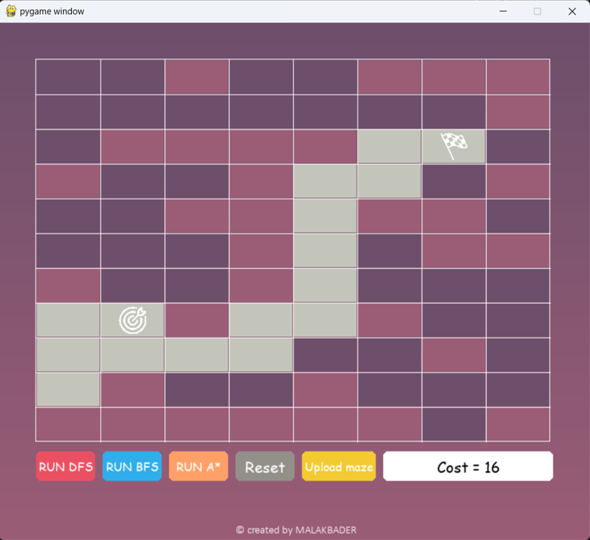

# Maze-Algorithm-Visualizer

Interactive Python maze solver using search algorithms.

## Introduction

The Maze Solver project is a Python-based application that provides an interactive environment for solving mazes using various search algorithms. Developed using the PyGame library, this application allows users to upload maze layouts from Excel files and apply different algorithms such as Depth-First Search (DFS), Breadth-First Search (BFS), and A* Search to find the shortest path from the start to the end of the maze.

## Key Features

- Upload maze layouts from Excel files.
- Visualize maze solving algorithms in real-time.
- Supports DFS, BFS, and A* Search algorithms.
- Provides detailed pathfinding results, including path cost and path visualization.
- User-friendly interface for easy navigation and interaction.

## Demo

[](Demo.mp4)

Click the image above to watch the demo video.

## Usage

### Excel Maze Layout

When creating maze layouts using Excel files, follow these guidelines:

- No header rows or columns.
- Use 0s to represent roads.
- Use 1s to represent blocks.
- Use "G" to represent the goal.
- Use "S" to represent the start point.

### Required Modules

To use Maze-Algorithm-Visualizer, you need to install the following Python modules:

```bash
pip install pygame
pip install pandas
pip install tk

